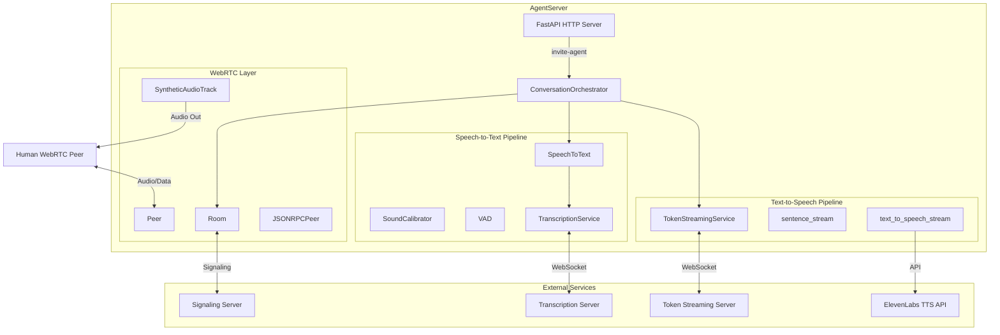

# AgentServer Documentation

AgentServer is a real-time voice AI agent that participates in WebRTC conversations. It listens to human speech, transcribes it, generates AI responses via a token streaming service, converts responses to speech, and streams the audio back to participants—all in real-time.

## System Architecture



## Data Flow

The system processes audio through a complete round-trip pipeline:

### Incoming Audio (Human → Agent)

1. **WebRTC Audio Reception**: Human peer's audio arrives via WebRTC `Peer` connection
2. **Calibration Check**: Audio is first routed to `SoundCalibrator` to measure ambient noise levels
3. **VAD Gating**: Once calibrated, audio passes through Voice Activity Detection (VAD)
4. **Speech Segmentation**: `SpeechToText` accumulates audio during speech, detects silence boundaries
5. **Transcription**: Complete speech segments are sent to external `TranscriptionService`
6. **Token Generation**: Transcribed text is forwarded to `TokenStreamingService` for AI response

### Outgoing Audio (Agent → Human)

1. **Token Reception**: AI tokens stream in from `TokenStreamingService`
2. **Sentence Buffering**: `sentence_stream` accumulates tokens until sentence boundaries
3. **Text-to-Speech**: Complete sentences are converted to PCM audio via ElevenLabs API
4. **Audio Queueing**: PCM samples are enqueued to `SyntheticAudioTrack` with sentence IDs
5. **WebRTC Streaming**: Audio frames are transmitted to human peers in real-time

## Entry Point

The agent is invited to join a conversation via HTTP POST:

```
POST /invite-agent
Content-Type: application/json
Authorization: Bearer <token>

{
    "context_id": "room-identifier"
}
```

This endpoint is defined in `src/app.py` and instantiates a `ConversationOrchestrator` for the given context.

## Environment Variables

| Variable | Description |
|----------|-------------|
| `SIGNALING_SERVER_URL` | WebSocket URL for WebRTC signaling server |
| `TOKEN_STREAMING_SERVER_URL` | WebSocket URL for AI token streaming service |
| `TRANSCRIPTION_SERVER_URL` | WebSocket URL for speech-to-text service |
| `ELEVENLABS_API_KEY` | API key for ElevenLabs text-to-speech |

## Key Design Decisions

### Calibration-Gated Audio Processing

Audio data is not processed for speech until the system has calibrated to ambient noise levels. This prevents false VAD triggers from background noise. The calibration period measures energy levels over ~5 seconds and sets an appropriate VAD threshold.

### Configurable Interruption Handling

The `allows_interruptions` flag controls whether incoming audio is processed while the agent is speaking:
- **Enabled**: Human can interrupt the agent mid-sentence
- **Disabled**: Incoming audio is ignored while `SyntheticAudioTrack` has queued audio

### Sentence-Level TTS Streaming

Rather than waiting for complete AI responses, the system streams audio sentence-by-sentence. Each sentence receives a unique ID that propagates through the TTS pipeline, enabling:
- Progress tracking (which sentence is currently being spoken)
- Event correlation for frontend UI updates
- Potential future features like sentence-level interruption

### Event-Driven Architecture

All components communicate via callback-based events, enabling loose coupling and async operation. The `JSONRPCPeer` class provides a standardized RPC layer used for:
- Signaling server communication
- WebRTC data channel messages to human peers
- External service communication

## Documentation Index

| Document | Description |
|----------|-------------|
| [Conversation Orchestrator](./conversation-orchestrator.md) | Core orchestrator that coordinates all components |
| [WebRTC Components](./webrtc.md) | Room, Peer, data channels, and audio tracks |
| [Speech-to-Text Pipeline](./speech-to-text.md) | VAD, calibration, and transcription |
| [Token Streaming](./token-streaming.md) | AI response generation service |
| [Text-to-Speech Pipeline](./text-to-speech.md) | Sentence streaming and audio synthesis |

## Quick Start

1. Set required environment variables
2. Install dependencies: `pip install -r requirements.txt`
3. Run the server: `uvicorn src.app:app --host 0.0.0.0 --port 8000`
4. Invite agent to a room via POST to `/invite-agent`

