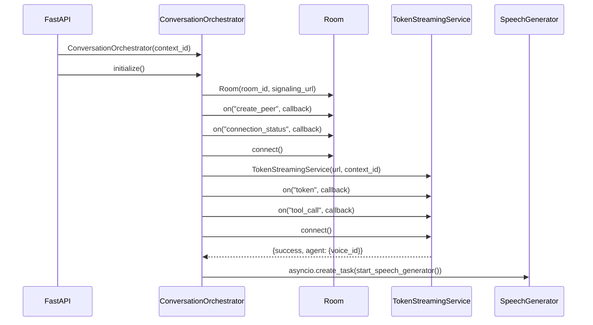
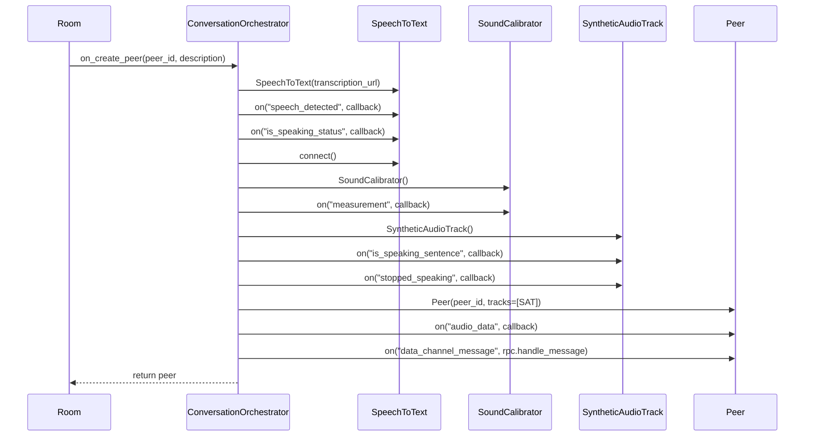
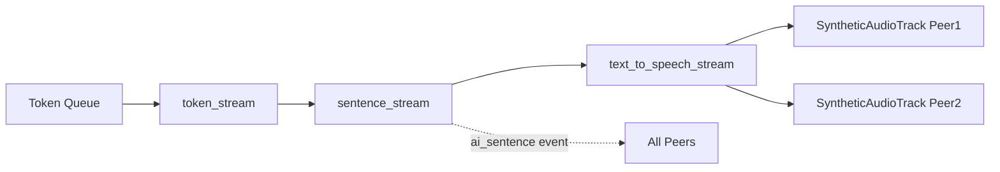
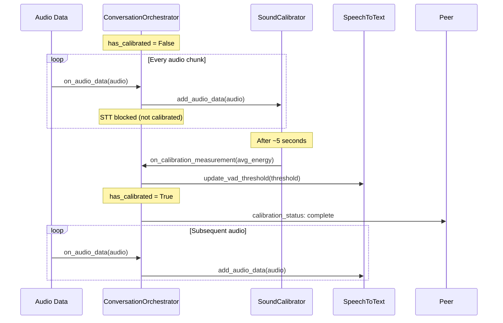

# Conversation Orchestrator

The `ConversationOrchestrator` is the central coordination hub of the AgentServer. It manages the lifecycle of a voice conversation, coordinating WebRTC connections, speech processing, AI response generation, and audio synthesis.

**Source**: `src/models/ConversationOrchestrator.py`

## Overview

When an agent is invited to a conversation via the `/invite-agent` endpoint, a `ConversationOrchestrator` instance is created. It:

1. Joins a WebRTC room via the signaling server
2. Connects to the token streaming service for AI responses
3. Creates per-peer resources (STT, calibration, audio tracks)
4. Orchestrates the bidirectional audio pipeline

## Constructor

```python
ConversationOrchestrator(
    context_id: str,
    allows_interruptions: bool = False,
    auth_token: Optional[str] = None
)
```

| Parameter | Description |
|-----------|-------------|
| `context_id` | Unique identifier for the conversation room |
| `allows_interruptions` | Whether human can interrupt agent while speaking |
| `auth_token` | Optional authentication token passed to token streaming service |

## Internal State

The orchestrator maintains several dictionaries to track per-peer resources:

```python
self.peer_to_stt: dict[str, SpeechToText]              # Speech-to-text instances
self.peer_to_calibration: dict[str, SoundCalibrator]   # Calibration instances
self.peer_to_media_stream: dict[str, SyntheticAudioTrack]  # Outgoing audio tracks
self.peer_to_data_channel_rpc_layer: dict[str, JSONRPCPeer]  # RPC communication
```

Additional state:
- `token_queue`: AsyncIO queue for buffering incoming AI tokens
- `sentence_counter`: Monotonically increasing ID for sentence tracking
- `has_calibrated`: Global flag indicating if ambient noise calibration is complete
- `voice_id`: ElevenLabs voice ID retrieved from token streaming service

## Initialization Flow



The `initialize()` method:
1. Creates and connects to the WebRTC `Room`
2. Creates and connects to the `TokenStreamingService`
3. Extracts `voice_id` from the connection response
4. Spawns the speech generator background task

## Peer Creation

When a new peer joins the room, the `on_create_peer` callback is invoked:



Each peer gets dedicated instances of:
- **SpeechToText**: Handles VAD and transcription for this peer's audio
- **SoundCalibrator**: Measures ambient noise for VAD threshold
- **SyntheticAudioTrack**: Generates outgoing audio frames
- **JSONRPCPeer**: RPC layer for data channel communication

## Audio Data Flow

When audio data arrives from a peer:

```python
async def on_audio_data(self, peer_id, audio_data, sample_rate):
    # Always feed calibrator
    self.peer_to_calibration[peer_id].add_audio_data(audio_data)
    
    # Gate 1: Must be calibrated
    if not self.has_calibrated:
        return
    
    # Gate 2: Interruption check
    if not self.allows_interruptions and self.peer_to_media_stream[peer_id].is_speaking():
        return
    
    # Process through STT
    await self.peer_to_stt[peer_id].add_audio_data(audio_data, sample_rate)
```

### Calibration Gating

Audio is **always** fed to the `SoundCalibrator`, but speech processing is blocked until `has_calibrated` is `True`. This ensures the VAD threshold is tuned to ambient noise before attempting speech detection.

### Interruption Handling

When `allows_interruptions` is `False`, incoming audio is discarded while the `SyntheticAudioTrack` has queued audio (i.e., the agent is speaking). This prevents:
- Echo/feedback loops
- Confusing conversation flow
- Transcription of agent's own speech

## Speech Generation Pipeline

The speech generator runs as a background task:

```python
async def start_speech_generator(self):
    async for sentence in sentence_stream(self.token_stream()):
        sentence_id = self.sentence_counter
        self.sentence_counter += 1
        
        # Notify peers of new sentence
        await self.send_call_to_all_peers("ai_sentence", {
            "sentence": sentence,
            "sentence_id": sentence_id,
        })
        
        # Convert to speech and enqueue
        async for pcm_data in text_to_speech_stream(sentence, voice_id=self.voice_id):
            for synthetic_audio_track in self.peer_to_media_stream.values():
                synthetic_audio_track.enqueue_audio_samples(pcm_data, sentence_id)
```



Key aspects:
1. **Token Queue**: Tokens from `TokenStreamingService` are buffered in `self.token_queue`
2. **token_stream()**: Async generator that yields tokens from the queue
3. **sentence_stream()**: Accumulates tokens until sentence boundaries (`.`, `!`, `?`)
4. **text_to_speech_stream()**: Converts sentences to PCM audio chunks
5. **Broadcast**: PCM chunks are enqueued to all peer audio tracks with sentence IDs

## Callback Architecture

The orchestrator receives events from multiple sources and routes them appropriately:

### From WebRTC Room
| Event | Handler | Action |
|-------|---------|--------|
| `create_peer` | `on_create_peer` | Creates per-peer resources |
| `connection_status` | `on_room_connection_status` | Broadcasts to all peers |

### From WebRTC Peer
| Event | Handler | Action |
|-------|---------|--------|
| `audio_data` | `on_audio_data` | Routes to calibrator/STT |
| `data_channel_connection_status` | `on_peer_data_channel_connection_status` | Notifies peer, triggers calibration |
| `connection_status` | `on_peer_connection_status` | Handles disconnection cleanup |

### From SpeechToText
| Event | Handler | Action |
|-------|---------|--------|
| `speech_detected` | `on_speach_detected` | Sends to token streaming service |
| `is_speaking_status` | `on_is_speaking_status` | Notifies peer |
| `connection_status` | `on_transcription_service_connection_status` | Notifies peer |

### From TokenStreamingService
| Event | Handler | Action |
|-------|---------|--------|
| `token` | `on_token` | Enqueues to token_queue |
| `tool_call` | `on_tool_call` | Broadcasts to all peers |
| `tool_response` | `on_tool_response` | Broadcasts to all peers |
| `connection_status` | `on_token_streaming_service_connection_status` | Broadcasts to all peers |

### From SyntheticAudioTrack
| Event | Handler | Action |
|-------|---------|--------|
| `is_speaking_sentence` | `on_is_speaking_sentence` | Notifies peer which sentence is playing |
| `stopped_speaking` | `on_stopped_speaking` | Notifies peer agent finished speaking |

### From SoundCalibrator
| Event | Handler | Action |
|-------|---------|--------|
| `measurement` | `on_calibration_measurement` | Sets VAD threshold, marks calibrated |

## Peer Lifecycle

### Connection Established

When a peer's data channel connects:
1. Notify peer of `data_channel_connection_status: connected`
2. Notify peer of `calibration_status: started`

### Peer Disconnection

When a peer disconnects (state: `disconnected`, `failed`, or `closed`):

```python
def on_peer_disconnected(self, peer_id):
    # Cleanup STT
    self.peer_to_stt[peer_id].close()
    del self.peer_to_stt[peer_id]
    
    # Cleanup calibrator
    del self.peer_to_calibration[peer_id]
    
    # Cleanup audio track
    del self.peer_to_media_stream[peer_id]
    
    # Cleanup RPC layer
    del self.peer_to_data_channel_rpc_layer[peer_id]
    
    # Remove from room
    self.room.remove_peer(peer_id)
    
    # If no peers left, shutdown everything
    if len(self.room.peers) == 0:
        self.room.close()
        self.token_streaming_service.close()
```

### Room Shutdown

When the last peer disconnects, the orchestrator:
1. Closes the WebRTC room (disconnects from signaling server)
2. Closes the token streaming service connection
3. All background tasks naturally complete

## RPC Communication

The orchestrator sends events to peers via JSON-RPC over WebRTC data channels:

```python
async def send_call_to_peer(self, peer_id: str, method: str, params: dict):
    if peer_id in self.peer_to_data_channel_rpc_layer:
        await self.peer_to_data_channel_rpc_layer[peer_id].call(method, params)

async def send_call_to_all_peers(self, method: str, params: dict):
    for peer_id in self.peer_to_data_channel_rpc_layer.keys():
        await self.send_call_to_peer(peer_id, method, params)
```

### Events Sent to Peers

| Method | Params | Description |
|--------|--------|-------------|
| `room_connection_status` | `{status}` | Room connected/disconnected |
| `data_channel_connection_status` | `{status}` | Data channel state |
| `connection_status` | `{status}` | WebRTC connection state |
| `calibration_status` | `{status}` | `started` or `complete` |
| `speech_detected` | `{text}` | Transcribed human speech |
| `is_speaking_status` | `{is_speaking}` | Human speaking state |
| `ai_sentence` | `{sentence, sentence_id}` | New AI sentence being spoken |
| `is_speaking_sentence` | `{sentence_id}` | Which sentence is currently playing |
| `stopped_speaking` | `{}` | Agent finished speaking |
| `tool_call` | `{tool_id, tool_name, tool_input}` | AI initiated tool call |
| `tool_response` | `{tool_id, tool_name, tool_output}` | Tool call result |
| `transcription_service_connection_status` | `{status}` | STT service state |
| `token_streaming_service_connection_status` | `{status}` | Token service state |

## Calibration Flow

The calibration process tunes VAD sensitivity to ambient noise:



The threshold calculation:
```python
MAX_SAMPLE = 32767
vad_threshold = (energy / (MAX_SAMPLE ** 2)) * 0.4
```

This sets VAD threshold to 40% above the measured ambient energy level.

## Error Handling

The orchestrator wraps critical operations in try/except blocks:
- `initialize()`: Raises exceptions on connection failures
- `on_create_peer()`: Raises exceptions on resource creation failures
- `on_audio_data()`: Raises exceptions on processing errors

Errors are logged with context (peer ID, operation) for debugging.

