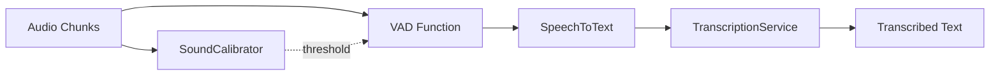
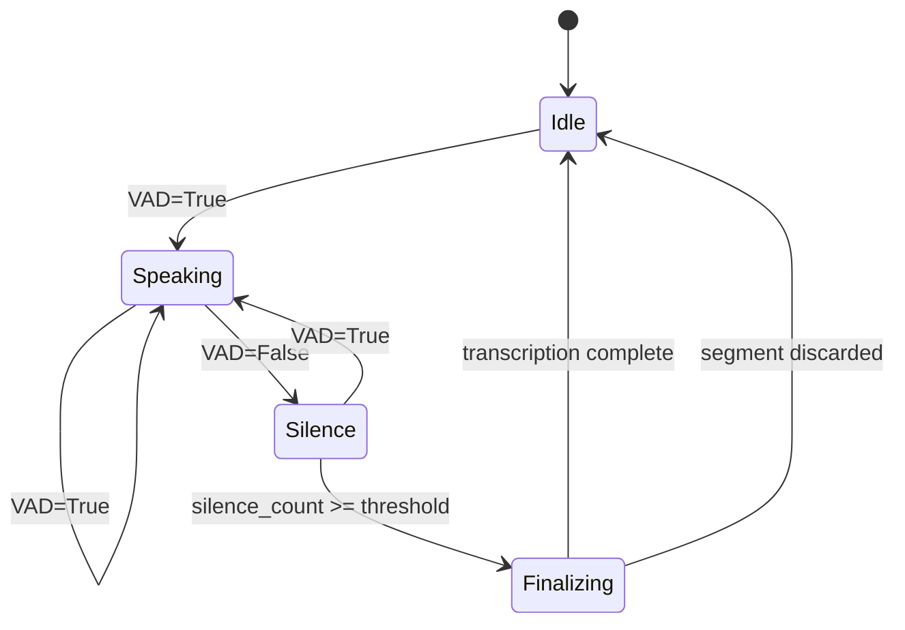
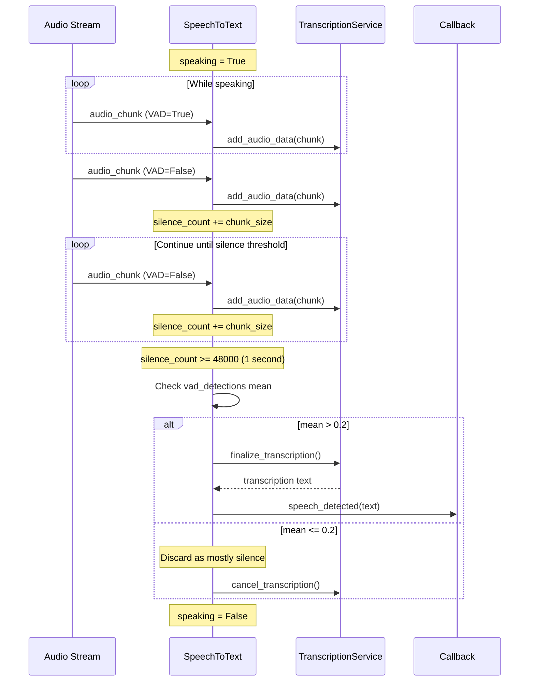
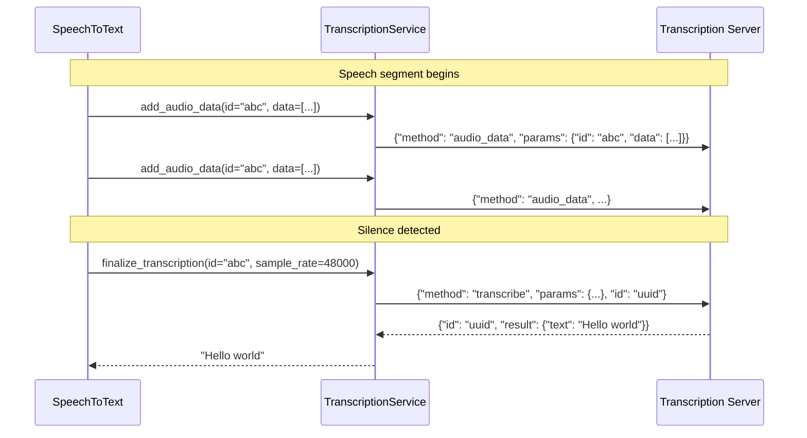
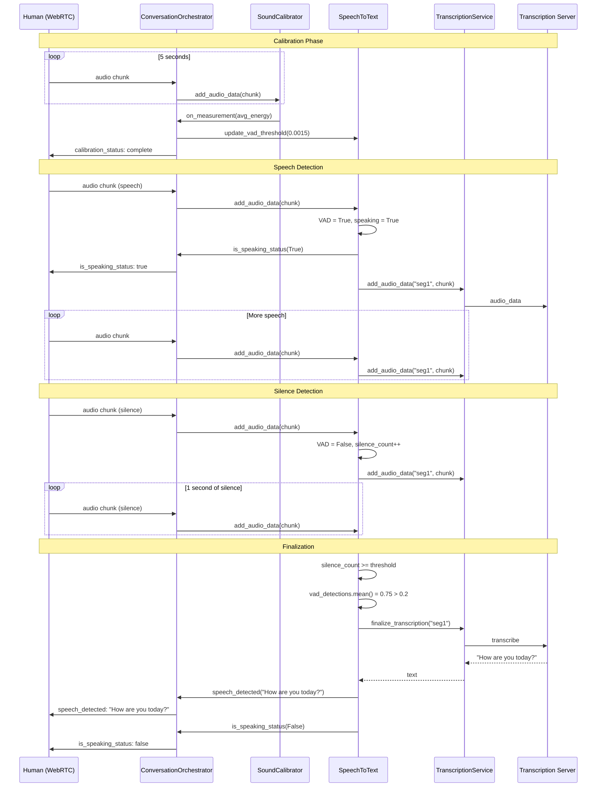

# Speech-to-Text Pipeline

The speech-to-text (STT) pipeline converts incoming human audio into text. It handles voice activity detection (VAD), audio segmentation, and transcription via an external service.

## Pipeline Overview



**Source Files**:
- `src/models/SoundCalibrator.py` - Ambient noise measurement
- `src/lib/vad.py` - Voice activity detection
- `src/models/SpeechToText.py` - Speech segmentation and state management
- `src/models/TranscriptionService.py` - External transcription client

---

## SoundCalibrator

Measures ambient noise energy to calibrate VAD sensitivity.

**Source**: `src/models/SoundCalibrator.py`

### Purpose

Before speech detection can work reliably, the system needs to understand the background noise level. The `SoundCalibrator` collects audio energy measurements over a calibration period and reports the average.

### Constructor

```python
SoundCalibrator(
    samples_per_chunk: int = 960,
    sample_rate: int = 48000,
    calibration_duration: int = 5
)
```

| Parameter | Default | Description |
|-----------|---------|-------------|
| `samples_per_chunk` | 960 | Samples per audio chunk (20ms at 48kHz) |
| `sample_rate` | 48000 | Audio sample rate in Hz |
| `calibration_duration` | 5 | Seconds to collect measurements |

### Events

| Event | Callback Signature | Description |
|-------|-------------------|-------------|
| `measurement` | `(energy: float) -> None` | Average energy after calibration period |

### Calibration Process

```python
def add_audio_data(self, audio_data):
    # Calculate energy (sum of squared samples)
    energy = np.sum(audio_data ** 2)
    self.energy_samples.append(energy)
    
    # Check if calibration period complete
    # clb_energy_sample_len = (48000 / 960) * 5 = 250 chunks
    if len(self.energy_samples) > self.clb_energy_sample_len:
        avg_energy = np.array(self.energy_samples).mean()
        self.on_measurement(avg_energy)
        self.energy_samples = []  # Reset for potential recalibration
```

### Energy Calculation

Energy is computed as the sum of squared sample values:

```
energy = Σ(sample²)
```

This measures the "loudness" of the audio chunk. Higher energy indicates louder sound.

### Calibration Timeline

```mermaid
gantt
    title Calibration Period (5 seconds)
    dateFormat X
    axisFormat %L
    
    section Audio Chunks
    Chunk 1-50 (1s): 0, 1000
    Chunk 51-100 (2s): 1000, 2000
    Chunk 101-150 (3s): 2000, 3000
    Chunk 151-200 (4s): 3000, 4000
    Chunk 201-250 (5s): 4000, 5000
    
    section Events
    measurement callback: milestone, 5000, 0
```



At 48kHz with 960-sample chunks, calibration collects 250 measurements over 5 seconds.

---

## Voice Activity Detection (VAD)

Determines whether an audio chunk contains human speech.

**Source**: `src/lib/vad.py`

### Function

```python
def vad(audio_data, energy_threshold=0.001) -> bool
```

| Parameter | Description |
|-----------|-------------|
| `audio_data` | NumPy array of audio samples |
| `energy_threshold` | Fraction of max possible energy to consider as voice |

Returns `True` if voice activity detected, `False` otherwise.

### Algorithm

```python
def vad(audio_data, energy_threshold=0.001):
    audio_data = np.asarray(audio_data, dtype=np.float32)
    
    MAX_SAMPLE = 32767  # Max value for 16-bit audio
    max_energy = len(audio_data) * (MAX_SAMPLE ** 2)  # Theoretical maximum
    energy = np.sum(audio_data ** 2)  # Actual energy
    
    return energy > max_energy * energy_threshold
```

### Energy Threshold Interpretation

The threshold is a fraction of the maximum possible energy:

- `energy_threshold = 0.001` means voice detected if energy > 0.1% of max
- Lower threshold = more sensitive (detects quieter sounds)
- Higher threshold = less sensitive (only detects louder sounds)

### Threshold Calibration

The `ConversationOrchestrator` calculates the threshold from calibration:

```python
MAX_SAMPLE = 32767
vad_threshold = (avg_energy / (MAX_SAMPLE ** 2)) * 0.4
```

This sets the threshold to 40% above the measured ambient energy, providing headroom to distinguish speech from background noise.

### Example Thresholds

| Ambient Energy | Calculated Threshold | Effect |
|----------------|---------------------|--------|
| Very quiet room | ~0.0001 | Very sensitive |
| Normal room | ~0.001 | Moderate sensitivity |
| Noisy environment | ~0.01 | Less sensitive |

---

## SpeechToText

Manages the speech detection state machine and coordinates transcription.

**Source**: `src/models/SpeechToText.py`

### Constructor

```python
SpeechToText(
    transcription_service_url: str,
    vad_threshold: float = 0.001,
    silence_duration_ms: int = 1000
)
```

| Parameter | Default | Description |
|-----------|---------|-------------|
| `transcription_service_url` | - | WebSocket URL of transcription service |
| `vad_threshold` | 0.001 | Initial VAD energy threshold |
| `silence_duration_ms` | 1000 | Silence duration to end speech segment |

### Events

| Event | Callback Signature | Description |
|-------|-------------------|-------------|
| `speech_detected` | `(text: str) -> None` | Final transcription result |
| `is_speaking_status` | `(is_speaking: bool) -> None` | Speaking state changes |
| `connection_status` | `(status: str) -> None` | Transcription service connection |

### State Machine



### Internal State

```python
self.speaking = False              # Currently in speech segment
self.silence_sample_count = 0      # Samples of silence detected
self.current_transcribe_id = None  # UUID for current segment
self.vad_detections = []           # Boolean history for filtering
```

### Audio Processing Flow

```python
async def add_audio_data(self, audio_data, sample_rate):
    # Run VAD
    has_voice = vad(audio_data, energy_threshold=self.vad_threshold)
    
    if has_voice:
        if not self.speaking:
            # Transition: Idle -> Speaking
            self.speaking = True
            await self.on_is_speaking_status(True)
            self.current_transcribe_id = str(uuid.uuid4())
        
        self.silence_sample_count = 0
        await self.transcription_service.add_audio_data(
            self.current_transcribe_id, audio_data
        )
    else:
        if self.speaking:
            # Still send audio during silence (captures trailing words)
            await self.transcription_service.add_audio_data(
                self.current_transcribe_id, audio_data
            )
            
            self.silence_sample_count += len(audio_data)
            silence_samples_to_wait = int((self.silence_duration_ms / 1000) * sample_rate)
            
            if self.silence_sample_count >= silence_samples_to_wait:
                # Silence threshold reached - finalize or discard
                ...
    
    # Track VAD detections for filtering
    if self.speaking:
        self.vad_detections.append(has_voice)
```

### Silence Detection



### False Positive Filtering

The `vad_detections` array tracks VAD results during a speech segment. If the mean is too low, the segment was mostly silence (likely a false trigger):

```python
if np.array(self.vad_detections).mean() > 0.2:
    # At least 20% of chunks had voice - real speech
    asyncio.create_task(self.finalize_transcript(...))
else:
    # Less than 20% had voice - probably noise/false trigger
    await self.transcription_service.cancel_transcription(...)
```

### Transcription Filtering

After transcription, certain results are discarded:

```python
if text and text.strip() not in ("Thank you.", ".", "", ".  .  .  ."):
    await self.on_speech_detected(text)
```

These patterns typically indicate:
- Empty speech segments
- Transcription artifacts
- Very short non-speech sounds

### Updating VAD Threshold

```python
def update_vad_threshold(self, vad_threshold: float):
    self.vad_threshold = vad_threshold
```

Called by `ConversationOrchestrator` after calibration completes.

---

## TranscriptionService

WebSocket client for the external transcription server.

**Source**: `src/models/TranscriptionService.py`

### Constructor

```python
TranscriptionService(transcription_service_url: str)
```

### Events

| Event | Callback Signature | Description |
|-------|-------------------|-------------|
| `connection_status` | `(status: str) -> None` | WebSocket connection state |

### Connection

```python
async def connect(self):
    self.websocket = SimpleWebSocketClient(self.transcription_service_url)
    self.rpc_layer = JSONRPCPeer(sender=lambda msg: asyncio.create_task(self.websocket.send(msg)))
    self.websocket.on("message", self.rpc_layer.handle_message)
    await self.websocket.connect()
```

### API Methods

#### add_audio_data

Streams audio chunks to the transcription service:

```python
async def add_audio_data(self, id: str, audio_data: np.ndarray):
    await self.rpc_layer.call("audio_data", {
        "id": id,
        "data": audio_data.tolist()
    })
```

- `id`: Unique identifier for this speech segment
- `data`: Audio samples as a list of integers

#### cancel_transcription

Cancels a speech segment (e.g., when detected as mostly silence):

```python
async def cancel_transcription(self, id: str):
    await self.rpc_layer.call("cancel_transcription", {"id": id})
```

#### finalize_transcription

Requests transcription of accumulated audio:

```python
async def finalize_transcription(self, id: str, sample_rate: int) -> str:
    response = await self.rpc_layer.call(
        "transcribe",
        {"id": id, "sample_rate": sample_rate},
        await_response=True,
        timeout=10
    )
    return response.get("text", None)
```

### Protocol Flow



---

## Complete Pipeline Example



---

## Configuration Tuning

### VAD Sensitivity

| Scenario | Recommended Threshold | Notes |
|----------|----------------------|-------|
| Quiet room | 0.0005 - 0.001 | Very sensitive |
| Normal office | 0.001 - 0.005 | Moderate |
| Noisy environment | 0.005 - 0.01 | Less sensitive |

### Silence Duration

| Value | Effect |
|-------|--------|
| 500ms | Quick response, may cut off slow speakers |
| 1000ms | Balanced (default) |
| 1500ms | Waits longer, better for deliberate speech |

### False Positive Threshold

The 0.2 (20%) threshold for VAD detection mean can be adjusted:
- Lower (0.1): Accept more segments, may include noise
- Higher (0.3): Stricter filtering, may miss quiet speech

