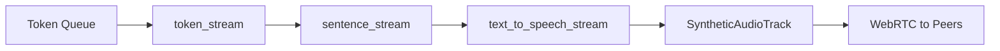
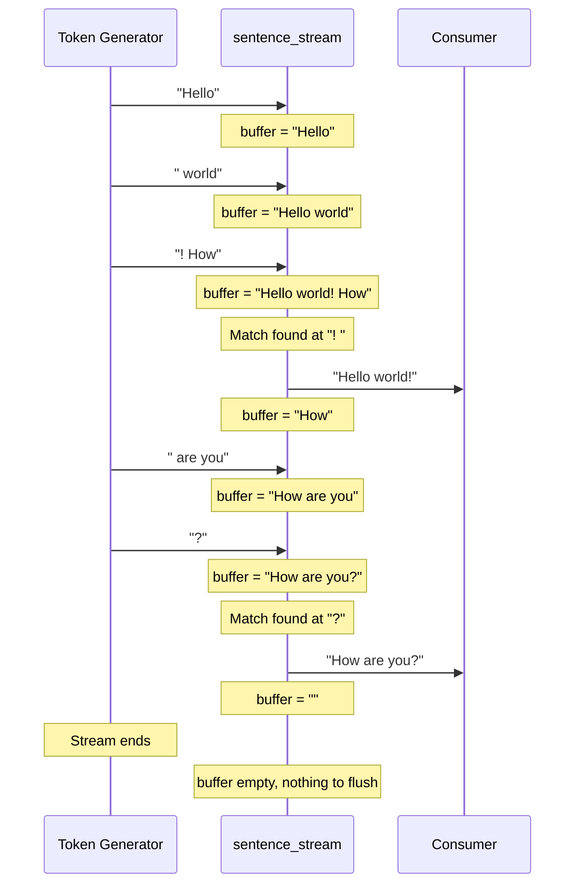
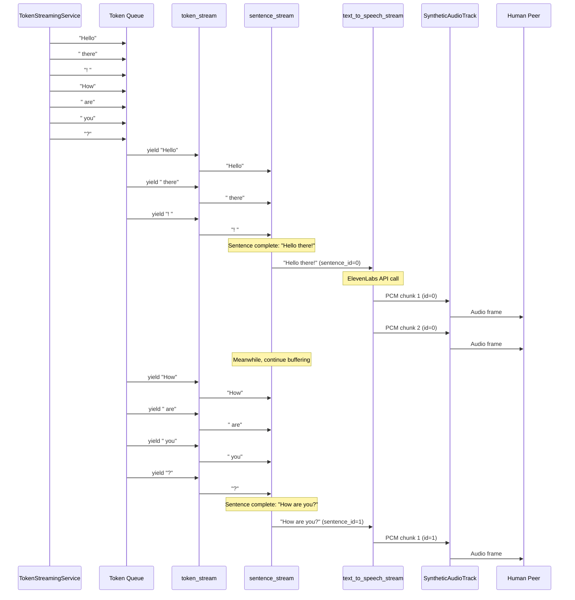

# Text-to-Speech Pipeline

The text-to-speech (TTS) pipeline converts AI response tokens into audio that is streamed to human peers. It handles sentence boundary detection, audio synthesis via ElevenLabs, and real-time streaming.

**Source Files**:
- `src/lib/sentence_stream.py` - Token-to-sentence buffering
- `src/lib/text_to_speech_stream.py` - ElevenLabs TTS integration

## Pipeline Overview



The pipeline processes tokens through three stages:
1. **Token streaming**: Yields tokens from the queue
2. **Sentence streaming**: Buffers tokens until sentence boundaries
3. **TTS streaming**: Converts sentences to PCM audio chunks

---

## Sentence Stream

Accumulates tokens and yields complete sentences.

**Source**: `src/lib/sentence_stream.py`

### Function

```python
async def sentence_stream(
    token_generator: AsyncGenerator[str, None]
) -> AsyncGenerator[str, None]
```

Takes an async generator of tokens and yields complete sentences.

### Sentence Boundary Detection

```python
SENTENCE_END_RE = re.compile(r"([.!?])([\s\n]|$)")
```

Sentences end when:
- A punctuation mark (`.`, `!`, `?`) is followed by whitespace or end-of-string
- This handles both mid-text sentences and final sentences

### Algorithm

```python
async def sentence_stream(token_generator):
    buffer = ""
    
    async for token in token_generator:
        buffer += token
        
        # Extract complete sentences
        while True:
            match = SENTENCE_END_RE.search(buffer)
            if not match:
                break
            
            end_idx = match.end()
            sentence = buffer[:end_idx].strip()
            if sentence:
                yield sentence
            buffer = buffer[end_idx:]
    
    # Flush remaining text at end
    if buffer.strip():
        yield buffer.strip()
```

### Example Processing



### Edge Cases

| Scenario | Handling |
|----------|----------|
| Multiple sentences in one token | Loop extracts all complete sentences |
| Abbreviations (e.g., "Dr. Smith") | May incorrectly split - known limitation |
| Ellipsis ("...") | Each period may trigger - known limitation |
| Final text without punctuation | Flushed at stream end |

---

## Text-to-Speech Stream

Converts text sentences to PCM audio using ElevenLabs API.

**Source**: `src/lib/text_to_speech_stream.py`

### Function

```python
async def text_to_speech_stream(
    text: str,
    voice_id: str
) -> AsyncGenerator[np.ndarray, None]
```

Takes a text string and yields PCM audio chunks as numpy arrays.

### Configuration

```python
voice_settings = VoiceSettings(
    stability=0.75,
    similarity_boost=0.75,
    style=0.5,
    speed=1,
    use_speaker_boost=True
)
```

| Setting | Value | Description |
|---------|-------|-------------|
| `stability` | 0.75 | Voice consistency (higher = more stable) |
| `similarity_boost` | 0.75 | Voice cloning accuracy |
| `style` | 0.5 | Expressiveness level |
| `speed` | 1 | Speaking rate (1 = normal) |
| `use_speaker_boost` | True | Enhanced voice clarity |

### ElevenLabs API Call

```python
stream = await loop.run_in_executor(None, lambda: client.text_to_speech.convert_as_stream(
    text=text,
    voice_id=voice_id,
    model_id="eleven_multilingual_v2",
    voice_settings=voice_settings,
    output_format="pcm_48000"
))
```

| Parameter | Value | Description |
|-----------|-------|-------------|
| `model_id` | `eleven_multilingual_v2` | Multilingual speech model |
| `output_format` | `pcm_48000` | 48kHz 16-bit PCM audio |

### Audio Processing

```python
def process_stream():
    for chunk in stream:
        if not isinstance(chunk, bytes):
            continue
        
        # Convert bytes to numpy array of 16-bit samples
        samples = np.frombuffer(chunk, dtype=np.int16)
        
        # Convert mono to stereo by duplicating channels
        stereo = np.column_stack((samples, samples)).flatten()
        
        yield stereo
```

The ElevenLabs API returns mono PCM audio. This is converted to stereo for WebRTC compatibility:

```
Mono:   [S1, S2, S3, S4, ...]
Stereo: [S1, S1, S2, S2, S3, S3, S4, S4, ...]
```

### Async Execution

The ElevenLabs SDK is synchronous, so it's wrapped in `run_in_executor`:

```python
loop = asyncio.get_event_loop()

# API call in thread pool
stream = await loop.run_in_executor(None, lambda: client.text_to_speech.convert_as_stream(...))

# Process chunks (also in thread pool to avoid blocking)
for pcm_chunk in await loop.run_in_executor(None, lambda: list(process_stream())):
    yield pcm_chunk
```

This ensures the event loop isn't blocked during:
1. The API request
2. Chunk processing

### Default Voice

If no voice_id is provided:

```python
if not voice_id:
    voice_id = "5egO01tkUjEzu7xSSE8M"  # Default voice
```

---

## Integration with Speech Generator

The `ConversationOrchestrator` ties everything together:

```python
async def start_speech_generator(self):
    async for sentence in sentence_stream(self.token_stream()):
        sentence_id = self.sentence_counter
        self.sentence_counter += 1
        
        # Notify peers of the sentence
        await self.send_call_to_all_peers("ai_sentence", {
            "sentence": sentence,
            "sentence_id": sentence_id,
        })
        
        # Convert to speech and enqueue
        async for pcm_data in text_to_speech_stream(sentence, voice_id=self.voice_id):
            for synthetic_audio_track in self.peer_to_media_stream.values():
                synthetic_audio_track.enqueue_audio_samples(pcm_data, sentence_id)
```

### Token Stream Generator

```python
async def token_stream(self):
    while True:
        token = await self.token_queue.get()
        yield token
```

Yields tokens from the queue populated by `TokenStreamingService`.

---

## Complete Pipeline Flow



---

## Sentence Tracking

Each sentence is assigned a unique, monotonically increasing ID:

```python
sentence_id = self.sentence_counter
self.sentence_counter += 1
```

This ID propagates through the pipeline:

1. **ai_sentence event**: Sent to peers when sentence is ready for TTS
2. **enqueue_audio_samples**: PCM data is tagged with sentence_id
3. **is_speaking_sentence event**: Sent when SyntheticAudioTrack starts playing a new sentence
4. **stopped_speaking event**: Sent when audio queue drains

### Event Timeline

```mermaid
gantt
    title Sentence Event Timeline
    dateFormat X
    axisFormat %Lms
    
    section Events
    ai_sentence id=0: milestone, 0, 0
    TTS generates audio: 0, 500
    ai_sentence id=1: milestone, 300, 0
    is_speaking_sentence id=0: milestone, 500, 0
    TTS generates audio: 300, 800
    is_speaking_sentence id=1: milestone, 2000, 0
    stopped_speaking: milestone, 3500, 0
```



---

## Audio Format Details

### ElevenLabs Output

| Property | Value |
|----------|-------|
| Format | PCM (raw samples) |
| Sample Rate | 48000 Hz |
| Bit Depth | 16-bit signed |
| Channels | 1 (mono) |

### After Processing

| Property | Value |
|----------|-------|
| Format | PCM (raw samples) |
| Sample Rate | 48000 Hz |
| Bit Depth | 16-bit signed |
| Channels | 2 (stereo) |

### SyntheticAudioTrack Requirements

The `SyntheticAudioTrack` expects:
- 48000 Hz sample rate
- Stereo (2 channel) audio
- 16-bit signed integer samples

The TTS pipeline outputs stereo by duplicating the mono channel.

---

## Performance Considerations

### Latency Sources

1. **ElevenLabs API latency**: Network round-trip + synthesis time
2. **Sentence buffering**: Waits for complete sentences
3. **Audio queue depth**: Affects responsiveness

### Optimization Strategies

**Sentence streaming** (current approach):
- Sentences are processed as soon as they're complete
- Audio begins playing before full response is generated
- Reduces perceived latency

**Async API calls**:
- `run_in_executor` prevents event loop blocking
- Allows concurrent operations (e.g., receiving more tokens while generating audio)

### Memory Management

The sentence stream processes text incrementally:
- Buffer only grows until sentence boundary
- Sentences are yielded and cleared
- No accumulation of full response text

---

## Error Handling

### Missing Voice ID

```python
if not voice_id:
    voice_id = "5egO01tkUjEzu7xSSE8M"  # Default fallback
```

### API Errors

The `text_to_speech_stream` can raise exceptions from:
- ElevenLabs API errors (invalid voice, quota exceeded)
- Network errors
- Invalid audio data

These propagate to the caller (`start_speech_generator`).

### Chunk Validation

```python
for chunk in stream:
    if not isinstance(chunk, bytes):
        continue  # Skip non-audio chunks
```

ElevenLabs streaming may include metadata chunks which are filtered out.

---

## Environment Setup

Required environment variable:

```bash
ELEVENLABS_API_KEY=your_api_key_here
```

The client is initialized at module load:

```python
client = ElevenLabs(api_key=os.getenv('ELEVENLABS_API_KEY'))
```

---

## Alternative Approaches (Commented Code)

The `sentence_stream.py` file contains commented alternative implementation:

```python
# def first_occurrence_end(text, substrings):
#     indices = [(text.find(sub) + len(sub)) for sub in substrings if text.find(sub) != -1]
#     return min(indices) if indices else -1
```

This simpler approach checked for explicit substring patterns (`". "`, `"! "`, `"? "`) but the regex-based approach is more robust for edge cases like end-of-stream detection.

