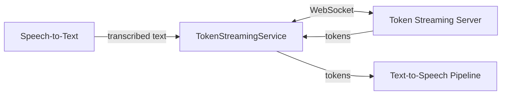
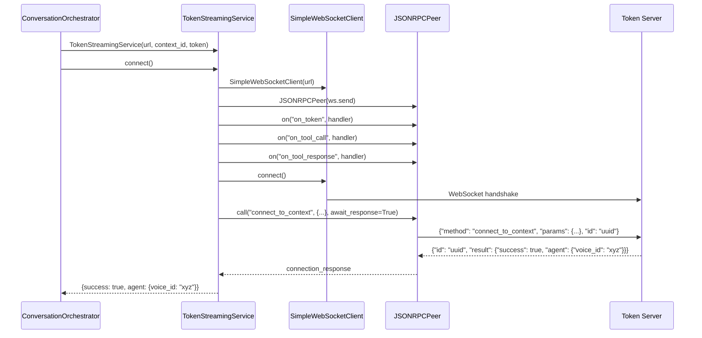
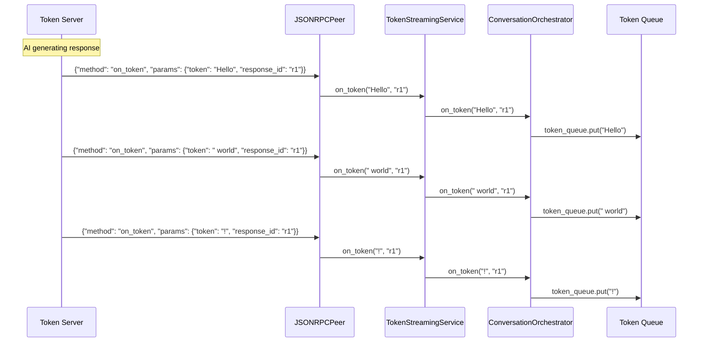
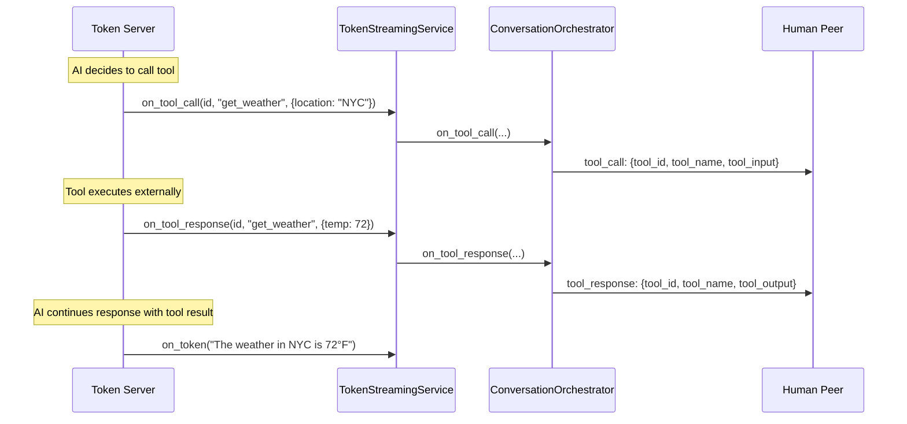
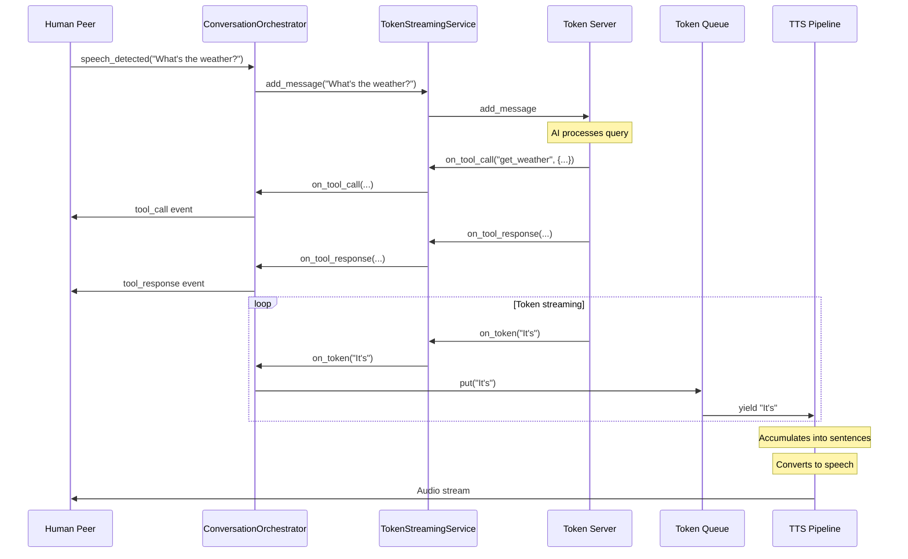

# Token Streaming Service

The `TokenStreamingService` connects to an external AI service that generates response tokens. It handles authentication, message submission, and streaming token reception.

**Source**: `src/models/TokenStreamingService.py`

## Overview

The token streaming service is the interface between transcribed human speech and AI-generated responses. When the user speaks, the transcribed text is sent to this service, which streams back response tokens that are then converted to speech.



## Constructor

```python
TokenStreamingService(
    token_streaming_url: str,
    context_id: str,
    auth_token: str = ''
)
```

| Parameter | Description |
|-----------|-------------|
| `token_streaming_url` | WebSocket URL of the token streaming server |
| `context_id` | Unique identifier for the conversation context |
| `auth_token` | Optional authentication token for the service |

## Events

| Event | Callback Signature | Description |
|-------|-------------------|-------------|
| `token` | `(token: str, response_id: str) -> None` | Received response token |
| `tool_call` | `(call_id: str, tool_name: str, tool_input: dict) -> None` | AI initiated a tool call |
| `tool_response` | `(call_id: str, response: str) -> None` | Tool call completed |
| `connection_status` | `(status: str) -> None` | WebSocket connection state |

## Connection Flow



### Connection Response

The `connect_to_context` call returns information about the agent:

```json
{
    "success": true,
    "agent": {
        "voice_id": "5egO01tkUjEzu7xSSE8M"
    }
}
```

The `voice_id` is used by the text-to-speech pipeline to generate audio in the correct voice.

## Internal Architecture

```python
async def connect(self):
    # WebSocket client
    self.websocket = SimpleWebSocketClient(self.token_streaming_url)
    
    # RPC layer for structured communication
    self.rpc_layer = JSONRPCPeer(
        sender=lambda msg: asyncio.create_task(self.websocket.send(msg))
    )
    
    # Register incoming event handlers
    self.rpc_layer.on("on_token", self.on_token)
    self.rpc_layer.on("on_tool_call", self.on_tool_call_callback)
    self.rpc_layer.on("on_tool_response", self.on_tool_response_callback)
    
    # Wire up message routing
    self.websocket.on("message", lambda msg: asyncio.create_task(
        self.rpc_layer.handle_message(msg)
    ))
    self.websocket.on("connection_status", self.on_connection_status_callback)
    
    # Connect and authenticate
    await self.websocket.connect()
    connection_response = await self.rpc_layer.call(
        method="connect_to_context",
        params={
            "context_id": self.context_id,
            "access_token": self.auth_token,
        },
        await_response=True,
        timeout=10
    )
    
    return connection_response
```

## Sending Messages

When human speech is transcribed, it's sent to the token streaming service:

```python
async def add_message(self, message: str):
    await self.rpc_layer.call("add_message", {
        "message": message,
    })
```

This is a fire-and-forget call (no response expected). The server will begin streaming response tokens.

## Receiving Tokens

Tokens are received via the `on_token` RPC method:



### Token Flow in ConversationOrchestrator

The orchestrator buffers tokens in a queue:

```python
async def on_token(self, token: str, response_id: str):
    await self.token_queue.put(token)
```

The speech generator consumes from this queue:

```python
async def token_stream(self):
    while True:
        token = await self.token_queue.get()
        yield token
```

## Tool Calls

The AI may request tool execution during response generation:

### Tool Call Event

```python
async def on_tool_call(self, tool_call_id: str, tool_name: str, tool_input: dict):
    # Broadcast to all connected peers
    await self.send_call_to_all_peers("tool_call", {
        "tool_id": tool_call_id,
        "tool_name": tool_name,
        "tool_input": tool_input,
    })
```

### Tool Response Event

```python
async def on_tool_response(self, tool_call_id: str, tool_name: str, tool_output: dict):
    # Broadcast result to all connected peers
    await self.send_call_to_all_peers("tool_response", {
        "tool_id": tool_call_id,
        "tool_name": tool_name,
        "tool_output": tool_output,
    })
```

### Tool Call Flow



## Protocol Reference

### Outgoing Methods

| Method | Params | Description |
|--------|--------|-------------|
| `connect_to_context` | `{context_id, access_token}` | Authenticate and join context |
| `add_message` | `{message}` | Send user message for AI response |

### Incoming Methods

| Method | Params | Description |
|--------|--------|-------------|
| `on_token` | `{token, response_id}` | Streaming response token |
| `on_tool_call` | `{tool_call_id, tool_name, tool_input}` | AI tool invocation |
| `on_tool_response` | `{tool_call_id, tool_name, tool_output}` | Tool execution result |

## Connection Lifecycle

### Initialization

1. Create `SimpleWebSocketClient` with server URL
2. Create `JSONRPCPeer` for structured messaging
3. Register event handlers for incoming methods
4. Connect WebSocket
5. Call `connect_to_context` to authenticate

### Active State

- Receive tokens via `on_token` events
- Send messages via `add_message` calls
- Handle tool calls/responses as they occur

### Shutdown

```python
def close(self):
    if self.websocket:
        asyncio.create_task(self.websocket.close())
```

Called by `ConversationOrchestrator` when the last peer disconnects.

## Error Handling

### Connection Timeout

The `connect_to_context` call has a 10-second timeout:

```python
connection_response = await self.rpc_layer.call(
    method="connect_to_context",
    params={...},
    await_response=True,
    timeout=10
)
```

If the server doesn't respond in time, a `TimeoutError` is raised.

### Connection Status

The `connection_status` event reports WebSocket state changes:
- `connected`: Successfully connected
- `disconnected`: Connection closed
- `failed`: Connection attempt failed

These are forwarded to the orchestrator for broadcast to peers.

## Integration with ConversationOrchestrator

The orchestrator sets up the token streaming service during initialization:

```python
async def initialize(self):
    # ... room setup ...
    
    self.token_streaming_service = TokenStreamingService(
        token_streaming_url=os.environ["TOKEN_STREAMING_SERVER_URL"],
        context_id=self.context_id,
        auth_token=self.auth_token,
    )
    
    # Register callbacks
    self.token_streaming_service.on("token", self.on_token)
    self.token_streaming_service.on("tool_call", self.on_tool_call)
    self.token_streaming_service.on("tool_response", self.on_tool_response)
    self.token_streaming_service.on("connection_status", 
        self.on_token_streaming_service_connection_status)
    
    # Connect and get agent info
    connection_request = await self.token_streaming_service.connect()
    
    if connection_request.get("success", False):
        self.voice_id = connection_request["agent"]["voice_id"]
```

## Complete Message Flow



