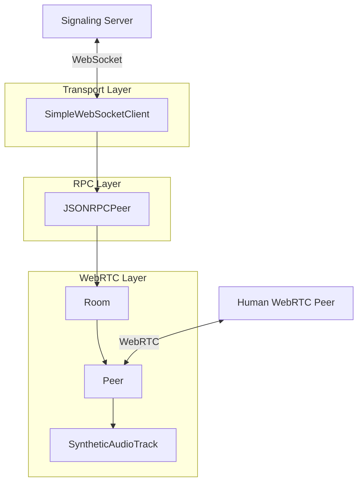
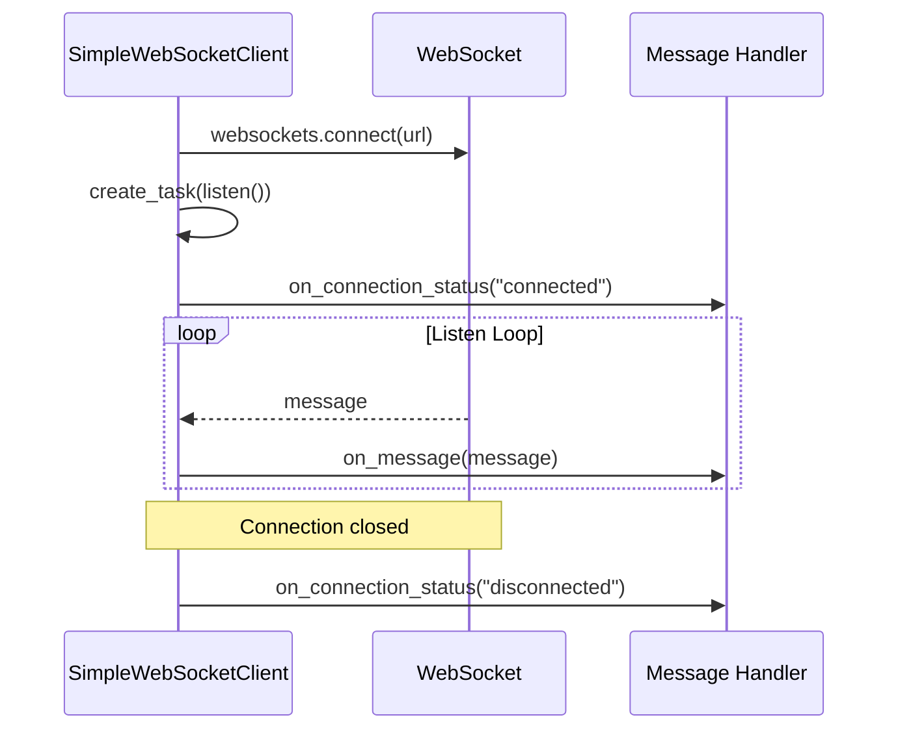
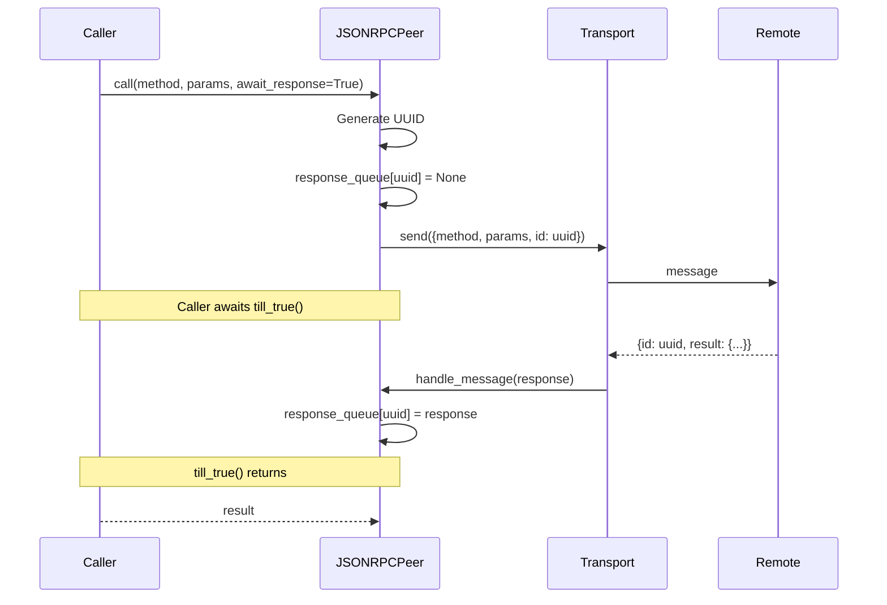
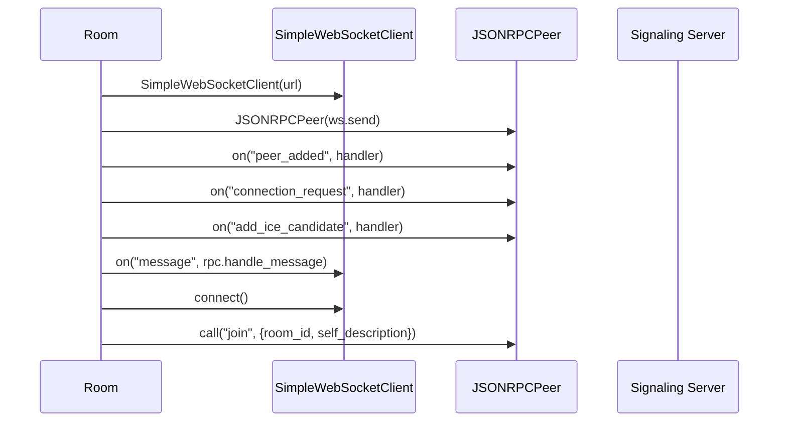
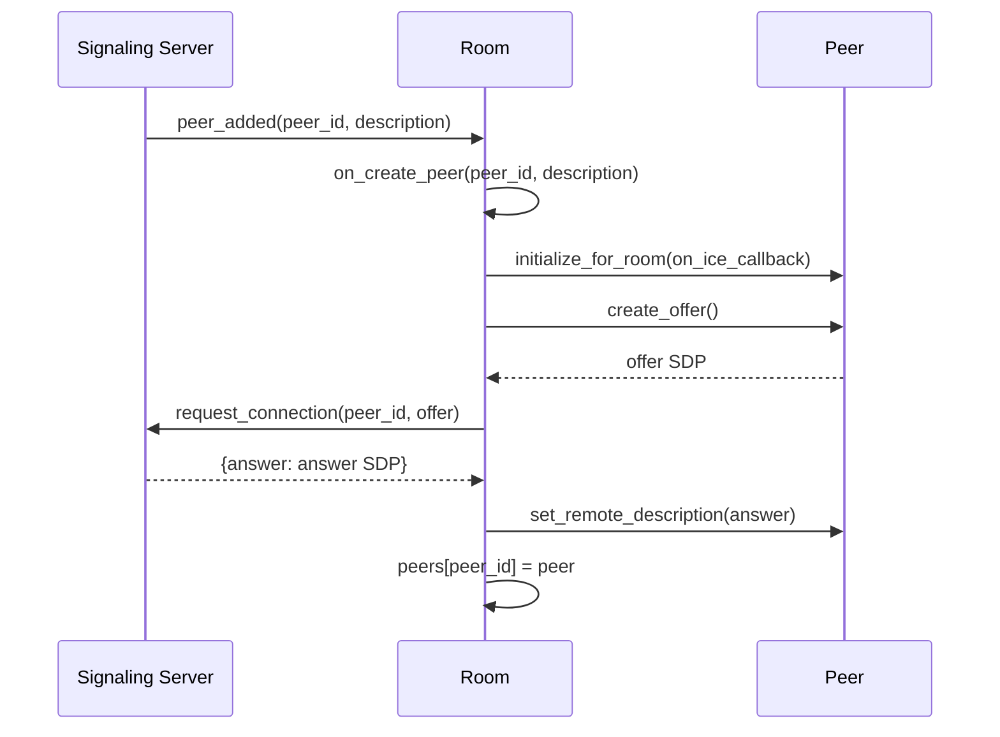
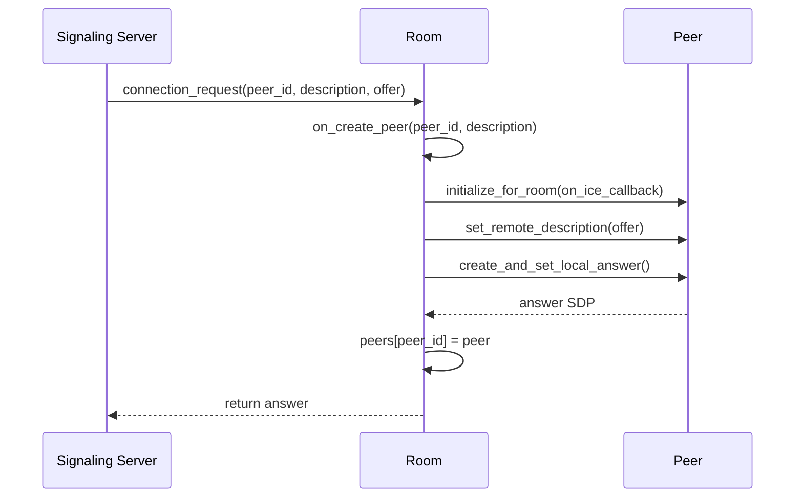

# WebRTC Components

The WebRTC layer handles real-time audio communication between the agent and human peers. It consists of several classes that abstract WebRTC complexity and provide an event-driven interface.

**Source Directory**: `src/lib/webrtc/`

## Architecture Overview



---

## SimpleWebSocketClient

A lightweight async WebSocket wrapper with event-based callbacks.

**Source**: `src/lib/webrtc/SimpleWebSocketClient.py`

### Constructor

```python
SimpleWebSocketClient(url: str)
```

### Events

| Event | Callback Signature | Description |
|-------|-------------------|-------------|
| `message` | `(message: str) -> None` | Received WebSocket message |
| `connection_status` | `(status: str) -> None` | Connection state changes (`connected`, `disconnected`, `failed`) |

### Methods

| Method | Description |
|--------|-------------|
| `connect()` | Establishes WebSocket connection, starts listen loop |
| `send(message: str)` | Sends message over WebSocket |
| `close()` | Cancels listen task, closes connection |

### Internal Behavior



The listen loop runs as a background task, invoking `on_message_callback` for each received message. Connection closure (normal or error) triggers the `disconnected` status.

---

## JSONRPCPeer

A bidirectional JSON-RPC 2.0-style implementation over any async transport. Used for both signaling server communication and WebRTC data channel messaging.

**Source**: `src/lib/webrtc/JSONRPCPeer.py`

### Constructor

```python
JSONRPCPeer(sender: Callable[[str], None])
```

The `sender` is an async function that transmits string messages (e.g., `websocket.send` or `data_channel.send`).

### Message Format

**Request (Notification)**:
```json
{
    "method": "method_name",
    "params": {"key": "value"},
    "id": null
}
```

**Request (Awaiting Response)**:
```json
{
    "method": "method_name",
    "params": {"key": "value"},
    "id": "uuid-string"
}
```

**Response**:
```json
{
    "id": "uuid-string",
    "result": {"key": "value"}
}
```

**Error Response**:
```json
{
    "id": "uuid-string",
    "result": {"error": "error message"}
}
```

### Registering Handlers

```python
rpc = JSONRPCPeer(sender=websocket.send)

# Register method handlers
rpc.on("peer_added", async_handler_function)
rpc.on("connection_request", another_handler)
```

Handlers receive keyword arguments from the `params` object:
```python
async def peer_added(peer_id: str, self_description: str):
    # Handle the call
    pass
```

### Making Calls

```python
# Fire-and-forget notification
await rpc.call("join", {"room_id": "abc123"})

# Request with response
result = await rpc.call(
    "request_connection",
    {"peer_id": "xyz", "offer": offer_dict},
    await_response=True,
    timeout=5
)
```

### Request/Response Correlation



The `till_true` utility polls until the response arrives or timeout occurs. Responses are matched by their `id` field.

### Error Handling

- **Timeout**: Raises `TimeoutError` if response not received within timeout
- **Remote Error**: Raises `Exception` if response contains `error` field
- **Unknown Method**: Logs warning, no response sent

---

## Room

Manages connection to the signaling server and coordinates peer creation/negotiation.

**Source**: `src/lib/webrtc/Room.py`

### Constructor

```python
Room(
    room_id: str,
    signaling_server_url: str,
    self_description: str
)
```

| Parameter | Description |
|-----------|-------------|
| `room_id` | Unique identifier for the conversation room |
| `signaling_server_url` | WebSocket URL of the signaling server |
| `self_description` | Human-readable description (e.g., "Agent") |

### Events

| Event | Callback Signature | Description |
|-------|-------------------|-------------|
| `create_peer` | `(peer_id: str, self_description: str) -> Peer` | Factory for creating new peers |
| `connection_status` | `(status: str) -> None` | Signaling server connection state |

### Connection Flow



### Signaling Protocol

The Room implements three signaling methods:

#### 1. peer_added (Outgoing Connection)

Called when another peer joins the room and this agent should initiate connection:



#### 2. connection_request (Incoming Connection)

Called when another peer initiates a connection to this agent:



#### 3. add_ice_candidate

Relays ICE candidates between peers:

```python
async def add_ice_candidate(self, peer_id: str, candidate):
    # Wait for peer to be created (up to 5 seconds)
    if not await till_true(lambda: peer_id in self.peers, timeout=5):
        print(f"Peer {peer_id} not added in time")
        return
    
    await self.peers[peer_id].add_ice_candidate(candidate)
```

### ICE Candidate Relay

When a peer discovers an ICE candidate, it's relayed through the signaling server:

```python
peer.initialize_for_room(
    on_ice_candidate=lambda candidate: self.rpc_layer.call(
        "relay_ice_candidate",
        {"peer_id": peer_id, "candidate": candidate}
    )
)
```

### Peer Management

```python
def remove_peer(self, peer_id: str):
    if peer_id in self.peers:
        self.peers[peer_id].close()
        del self.peers[peer_id]

def close(self):
    asyncio.create_task(self.websocket.close())
    for peer in self.peers.values():
        peer.close()
    self.peers = {}
```

---

## Peer

Wraps `aiortc.RTCPeerConnection` with event-driven callbacks for audio, data channels, and connection state.

**Source**: `src/lib/webrtc/Peer.py`

### Constructor

```python
Peer(
    peer_id: str,
    self_description: str,
    create_data_channel: bool = False,
    tracks: List[MediaStreamTrack] = []
)
```

| Parameter | Description |
|-----------|-------------|
| `peer_id` | Unique identifier for this peer |
| `self_description` | Human-readable description |
| `create_data_channel` | Whether to create outgoing data channel |
| `tracks` | Media tracks to add (e.g., SyntheticAudioTrack) |

### Events

| Event | Callback Signature | Description |
|-------|-------------------|-------------|
| `audio_data` | `(peer_id: str, samples: list, sample_rate: int) -> None` | Received audio frame |
| `data_channel_connection_status` | `(peer_id: str, status: str) -> None` | Data channel state |
| `data_channel_message` | `(message: str) -> None` | Received data channel message |
| `connection_status` | `(peer_id: str, status: str) -> None` | WebRTC connection state |

### Initialization for Room

```python
def initialize_for_room(self, on_ice_candidate: Callable):
    # Create RTCPeerConnection with STUN server
    self.pc = RTCPeerConnection(configuration=RTCConfiguration(
        iceServers=[RTCIceServer(urls=["stun:stun.l.google.com:19302"])]
    ))
    
    # Setup data channel (if requested)
    # Add media tracks
    # Register event handlers
```

### WebRTC Event Handlers

```python
@self.pc.on("datachannel")
def on_datachannel(channel):
    # Incoming data channel from remote peer
    self.setup_data_channel(channel)

@self.pc.on("track")
async def on_track(track):
    # Incoming media track from remote peer
    if track.kind == "audio":
        asyncio.create_task(self.tap_audio_stream(track))

@self.pc.on("icecandidate")
async def on_icecandidate(event):
    # Local ICE candidate discovered
    if event.candidate:
        await on_ice_candidate(self.peer_id, event.candidate)

@self.pc.on("connectionstatechange")
async def on_connectionstatechange():
    # Connection state: new, connecting, connected, disconnected, failed, closed
    await self.on_connection_status(self.peer_id, self.pc.connectionState)
```

### Data Channel Setup

```python
def setup_data_channel(self, channel: RTCDataChannel):
    self.data_channel = channel
    
    channel.on("message", lambda msg: asyncio.create_task(self.on_message(msg)))
    
    def handle_open():
        asyncio.create_task(self.on_data_channel_connection_status(self.peer_id, "connected"))
    channel.on("open", handle_open)
    
    # Handle already-open channels
    if channel.readyState == "open":
        handle_open()
    
    channel.on("close", lambda: asyncio.create_task(
        self.on_data_channel_connection_status(self.peer_id, "disconnected")
    ))
```

### Audio Stream Tapping

```python
async def tap_audio_stream(self, track):
    while True:
        try:
            frame = await track.recv()
            
            # Extract PCM samples from frame
            interleaved_samples = frame.to_ndarray()[0]
            samples = interleaved_samples[::2]  # Extract single channel
            
            await self.on_audio_data(self.peer_id, samples, frame.sample_rate)
        except Exception as e:
            print(f"Error receiving audio: {e}")
            break
```

The audio is received as interleaved stereo samples. The `[::2]` slice extracts every other sample to get mono audio for processing.

### Signaling Methods

```python
async def create_offer(self):
    offer = await self.pc.createOffer()
    await self.pc.setLocalDescription(offer)
    return {"sdp": self.pc.localDescription.sdp, "type": self.pc.localDescription.type}

async def set_remote_description(self, description: dict):
    desc = RTCSessionDescription(sdp=description["sdp"], type=description["type"])
    await self.pc.setRemoteDescription(desc)

async def create_and_set_local_answer(self):
    answer = await self.pc.createAnswer()
    await self.pc.setLocalDescription(answer)
    return {"sdp": self.pc.localDescription.sdp, "type": self.pc.localDescription.type}

async def add_ice_candidate(self, candidate: dict):
    # Parse candidate SDP string into structured fields
    parsed = parse_candidate_sdp(candidate["candidate"])
    await self.pc.addIceCandidate(RTCIceCandidate(...))
```

### ICE Candidate Parsing

The `parse_candidate_sdp` utility extracts structured fields from ICE candidate SDP strings:

```
candidate:foundation component protocol priority ip port type ...
```

Fields extracted: `foundation`, `component`, `protocol`, `priority`, `ip`, `port`, `type`

---

## SyntheticAudioTrack

A custom `MediaStreamTrack` that generates audio frames from an internal queue. Used to stream TTS output to remote peers.

**Source**: `src/lib/webrtc/SyntheticAudioTrack.py`

### Configuration

| Property | Value | Description |
|----------|-------|-------------|
| `sample_rate` | 48000 Hz | Audio sample rate |
| `channels` | 2 (stereo) | Audio channels |
| `frame_size` | 960 samples | 20ms frame at 48kHz |

### Events

| Event | Callback Signature | Description |
|-------|-------------------|-------------|
| `is_speaking_sentence` | `(sentence_id: int) -> None` | New sentence started playing |
| `stopped_speaking` | `() -> None` | Audio queue drained |

### Internal State

```python
self.samples = deque()      # PCM sample queue
self.sentence_ids = deque() # Corresponding sentence IDs
self.timestamp = 0          # Current frame timestamp
self.current_sentence_id = None
self.validating_speaking_stop = False
```

### Frame Generation

```python
async def recv(self):
    # Timing: wait until it's time for next 20ms frame
    elapsed = time.time() - self.start_time
    expected_ts = self.timestamp * self.time_base
    sleep_time = float(expected_ts - elapsed)
    if sleep_time > 0:
        await asyncio.sleep(sleep_time)
    
    # Get samples or generate silence
    needed_samples = self.frame_size * self.channels  # 960 * 2 = 1920
    
    if len(self.samples) >= needed_samples:
        # Extract samples and sentence IDs
        frame_data = [self.samples.popleft() for _ in range(needed_samples)]
        chunk_sentence_ids = [self.sentence_ids.popleft() for _ in range(needed_samples)]
        
        # Check for sentence transition
        if chunk_sentence_ids[-1] != self.current_sentence_id:
            self.current_sentence_id = chunk_sentence_ids[-1]
            self.on_is_speaking_sentence(self.current_sentence_id)
    else:
        frame_data = [0] * needed_samples  # Silence
        if self.current_sentence_id is not None:
            self.current_sentence_id = None
            asyncio.create_task(self.possible_speaking_stop())
    
    # Build audio frame
    frame = np.array(frame_data, dtype=np.int16).reshape((1, -1))
    audio_frame = av.AudioFrame.from_ndarray(frame, format='s16', layout='stereo')
    audio_frame.sample_rate = self.sample_rate
    audio_frame.pts = self.timestamp
    audio_frame.time_base = self.time_base
    
    self.timestamp += self.frame_size
    return audio_frame
```

### Timing Model

```mermaid
gantt
    title Frame Timing (48kHz, 20ms frames)
    dateFormat X
    axisFormat %L ms
    
    section Frames
    Frame 0 (960 samples): 0, 20
    Frame 1 (960 samples): 20, 40
    Frame 2 (960 samples): 40, 60
    Frame 3 (960 samples): 60, 80
```



Each frame is 960 samples at 48kHz = 20ms. The `recv()` method uses wall-clock timing to ensure frames are produced at the correct rate.

### Enqueuing Audio

```python
def enqueue_audio_samples(self, audio_samples, sentence_id=None):
    self.samples.extend(audio_samples)
    if sentence_id is not None:
        self.sentence_ids.extend([sentence_id] * len(audio_samples))
```

Each sample is tagged with its sentence ID, enabling tracking of which sentence is currently being played.

### Speaking State Detection

```python
async def possible_speaking_stop(self):
    if self.validating_speaking_stop:
        return
    self.validating_speaking_stop = True
    
    await asyncio.sleep(1)  # Wait for potential new samples
    
    if len(self.samples) < (self.frame_size * self.channels):
        self.on_stopped_speaking()
    
    self.validating_speaking_stop = False

def is_speaking(self):
    return len(self.samples) > (self.frame_size * self.channels)
```

The `possible_speaking_stop` method waits 1 second before declaring speech complete. This handles gaps between sentences where the TTS pipeline may be generating the next sentence.

### WAV File Loading (Utility)

```python
async def enqueue_wav(self, wav_path):
    audio = AudioSegment.from_wav(wav_path)
    
    # Normalize to expected format
    if audio.channels != self.channels:
        audio = audio.set_channels(self.channels)
    if audio.frame_rate != self.sample_rate:
        audio = audio.set_frame_rate(self.sample_rate)
    
    samples = np.frombuffer(audio.raw_data, dtype=np.int16)
    self.samples.extend(samples)
```

---

## Utility Functions

### till_true

**Source**: `src/lib/webrtc/functions/till_true.py`

Polls a condition until it becomes true or timeout expires:

```python
async def till_true(condition: Callable[[], bool], timeout: int = 5) -> bool:
    # Polls every ~10ms until condition() returns True or timeout
```

Used for waiting on async state changes (e.g., response arrival, peer creation).

### parse_candidate_sdp

**Source**: `src/lib/webrtc/functions/parse_candidate_sdp.py`

Parses ICE candidate SDP strings into structured dictionaries for `RTCIceCandidate` construction.

